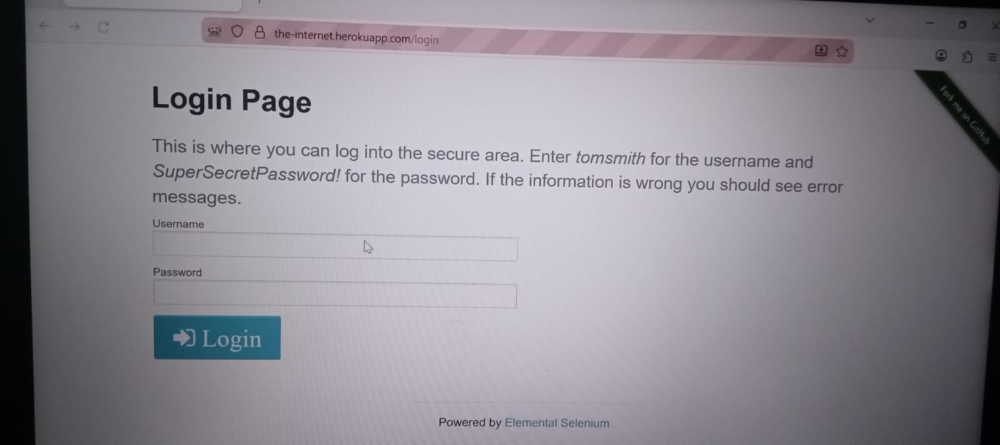
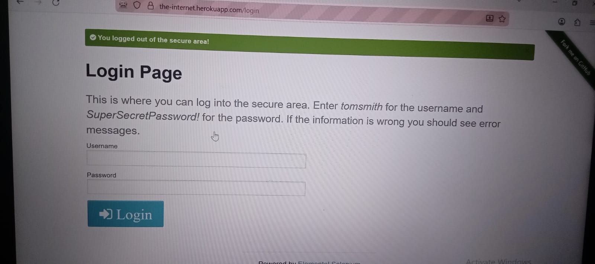
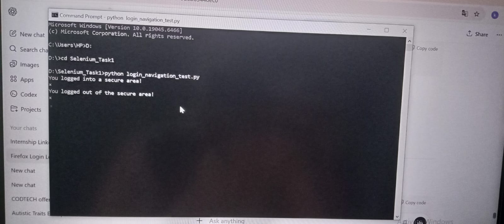

# CODTECH Internship - Task 1

## Intern Details
- **Name:** Katikala Kaveri
- **Intern ID:** CTIS5250

## Task Name
Test Automation Using Selenium

## Description
This project automates the login and navigation functionality of a sample web application using Selenium WebDriver in Python.  
The automation includes:
- Logging into the web app
- Verifying login messages
- Logging out
- Capturing screenshots for proof of execution

## Tools Used
- Python
- Selenium WebDriver
- Mozilla Firefox

## Files in Repository
- `login_navigation_test.py` : Selenium script for login and logout automation
- `Test_Execution_Report.txt` : Test execution report
- `proof_screenshots` folder (optional) : Contains screenshots
  - `login_success.png`
  - `logout_success.png`
  - `cmd_run.png`
- `README.md` : Project description and instructions

## Proof of Execution

### Login Screenshot

### Logout Screenshot

### Command Prompt Screenshot

